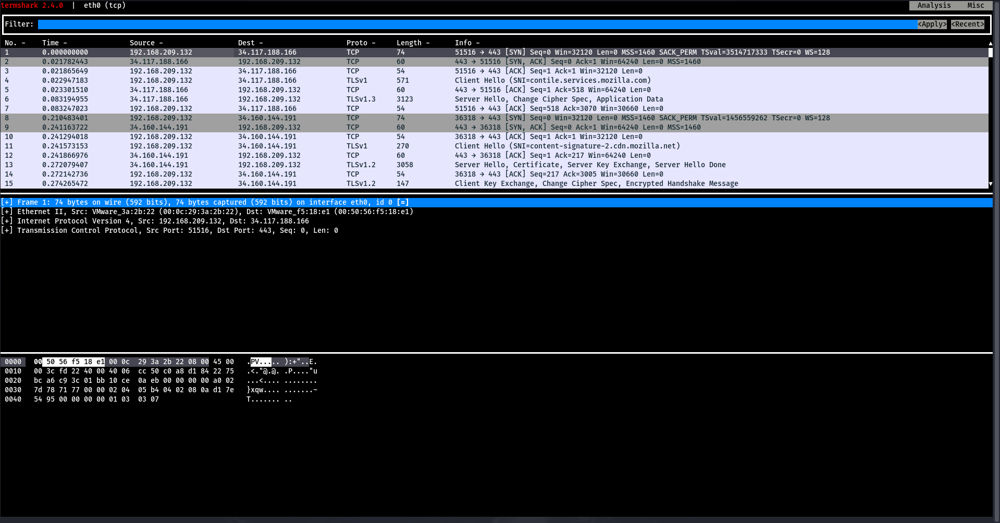
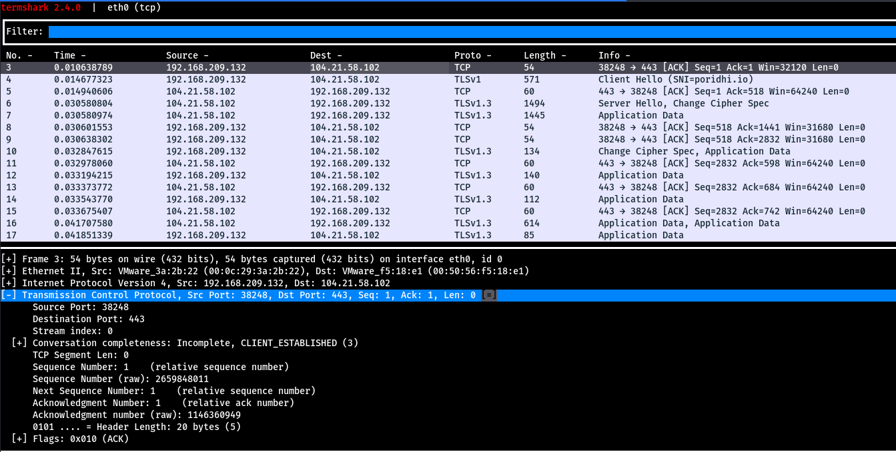
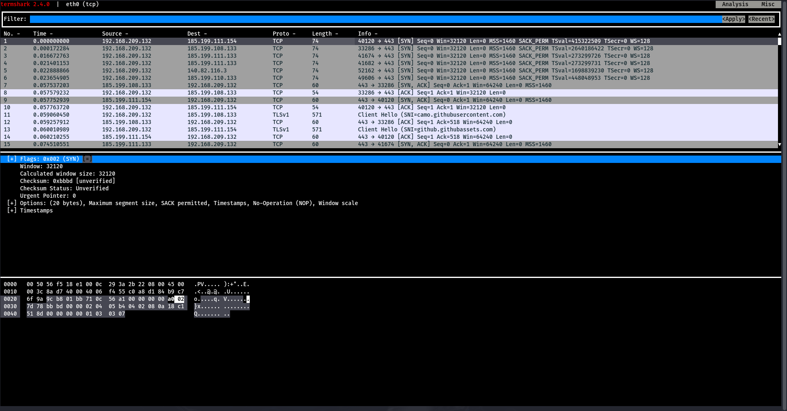

# Analyzing Network Packets Using Termshark to Identify Layers in the OSI Model
## Introduction
The OSI model is a conceptual framework used to understand and teach network communication functionality and services. It divides communication into 7 layers and explains how each layer works with the help of protocols. In this lab, we will use Termshark to capture and analyze network traffic at different layers of the OSI model.

### What is Termshark?
Termshark is a terminal-based packet analyzer for Linux, macOS, and Windows. It provides a text-based user interface (TUI) for inspecting captured network packets, making it a lightweight alternative to Wireshark for users who prefer the command line.

Key Features:
* **TUI Interface:** Provides an ncurses-based interface for viewing and filtering packets
* **Wireshark-Compatible:** Uses TShark (Wireshark's CLI tool) under the hood to process pcap files
* **Packet Inspection:** Supports deep packet analysis, including headers, payloads, and protocol details
* **Filtering:** Uses Wireshark display filters to search and analyze packets efficiently
* **Lightweight:** Suitable for low-resource environments compared to GUI-based tools

## Analyzing TCP Protocol Packets
### 1. Capture TCP packets on interface eth0
```bash
termshark -i eth0 tcp
```

### 2. Analyzing a TCP Packet in Termshark
Select a packet where the Protocol column contains "TCP". In the packet details pane, you'll see 4 main sections:
* **Frame n:** This represents the packet number in the capture sequence. The frame shows the communication between source (192.168.209.132) and destination (34.117.188.166).
* **Ethernet II:** This is the Data Link Layer (OSI Layer 2) header containing source and destination MAC addresses.
* **IPv4:** This is the Network Layer (OSI Layer 3) header containing source and destination IP addresses.
* **TCP:** This is the Transport Layer (OSI Layer 4) header containing port numbers and sequence information.

#### Understanding Physical Layer and Upper Layers
* **Physical Layer (Layer 1):** Packet capturing tools cannot directly observe the physical layer, which deals with the actual transmission medium (wire, wireless, Bluetooth). Sniffers only capture packets at the network interface level, not the physical signals (which would appear as binary data).
* **Upper Layers (5-7):** In our example TCP SYN packet, we don't see the upper layers because this packet is part of the connection establishment process. SYN packets don't carry application data, so the Session, Presentation, and Application layers are not involved yet.



When data reaches the **Transport Layer**, it adds the TCP/UDP header containing crucial information like:
- Source and destination port numbers
- Sequence numbers
- Control flags
- Other TCP-specific fields


The TCP header format is structured as follows:


### Analyzing the TCP Header in Termshark



Key components in our captured TCP header:
* **Ports:** Source port 40120 (web browser) and destination port 443 (HTTPS)
* **Stream Index:** Identifies the conversation flow. Each new TCP connection gets a unique stream index
* **Sequence/Acknowledgment Numbers:** Both are 0 in this case since this is a SYN packet initiating the connection
* **Header Length:** 40 bytes (TCP headers can range from 20 to 60 bytes, with optional fields)

The TCP flags section shows various control bits:


The reserved bits are kept for future protocol extensions.



The window size field is crucial for flow control, indicating how many bytes the sender can transmit before requiring an acknowledgment. The checksum ensures data integrity, and urgent pointer is used for priority data handling.