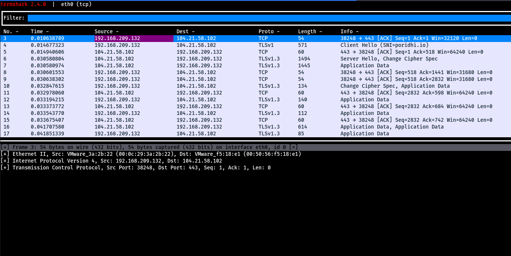
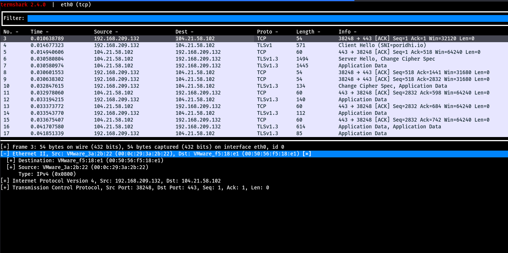
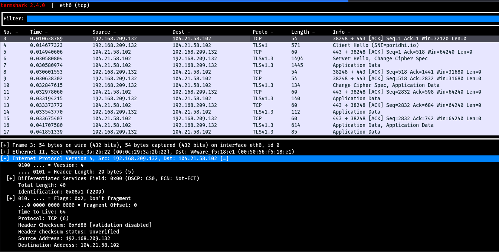
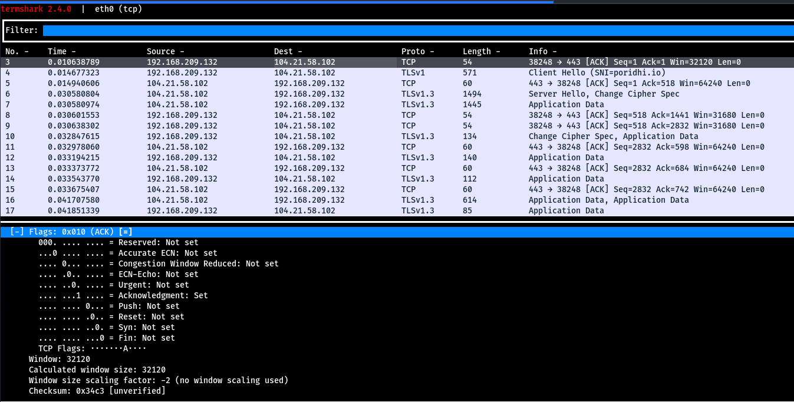
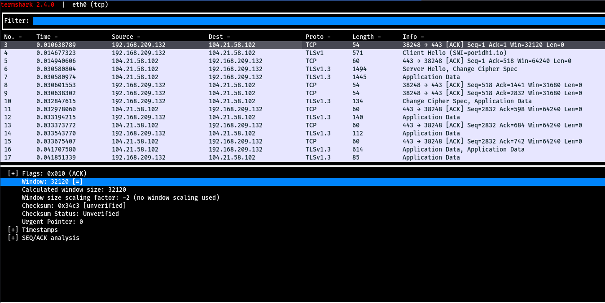
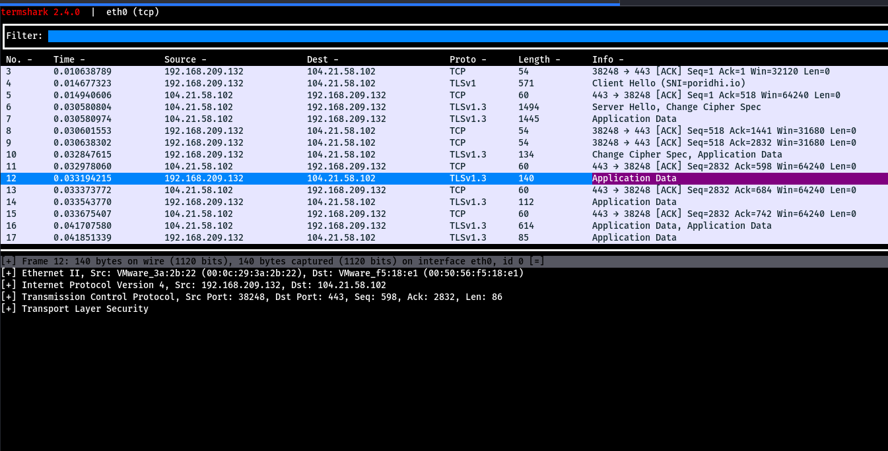
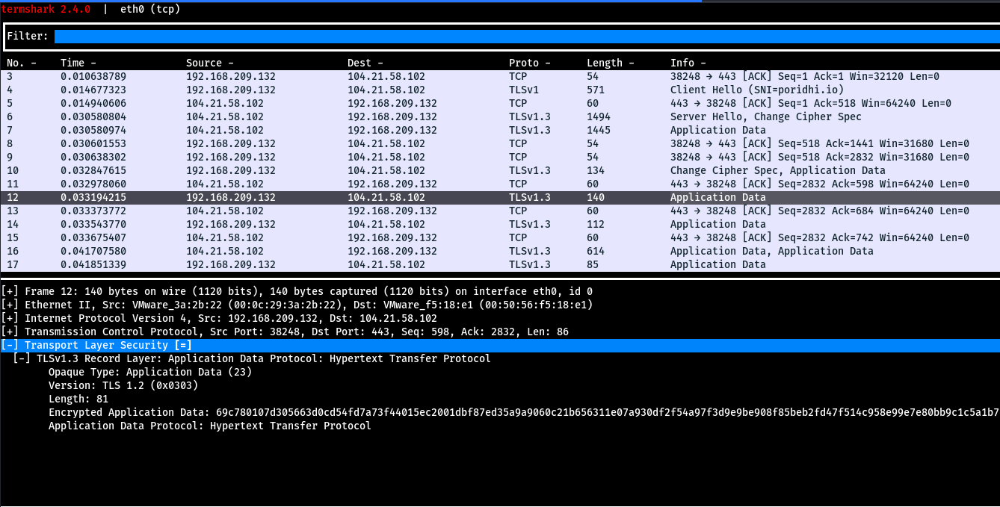

# Analyzing Network Packets Using Termshark to Identify Layers in the OSI Model
## Introduction
The OSI model is a conceptual framework used to understand and teach network communication functionality and services. It divides communication into 7 layers and explains how each layer works with the help of protocols. In this lab, we will use Termshark to capture and analyze network traffic at different layers of the OSI model.

### What is Termshark?
Termshark is a terminal-based packet analyzer for Linux, macOS, and Windows. It provides a text-based user interface (TUI) for inspecting captured network packets, making it a lightweight alternative to Wireshark for users who prefer the command line.

Key Features:
* **TUI Interface:** Provides an ncurses-based interface for viewing and filtering packets
* **Wireshark-Compatible:** Uses TShark (Wireshark's CLI tool) under the hood to process pcap files
* **Packet Inspection:** Supports deep packet analysis, including headers, payloads, and protocol details
* **Filtering:** Uses Wireshark display filters to search and analyze packets efficiently
* **Lightweight:** Suitable for low-resource environments compared to GUI-based tools

## Analyzing TCP Protocol Packets
### 1. Capture TCP packets on interface eth0
```bash
poridhi@poridhi:~$ termshark -i eth0 tcp
```

### 2. Analyzing a TCP Packet in Termshark
Select a packet where the Protocol column contains "TCP". In the packet details pane, you'll see 4 main sections:
* **Frame n:** This represents the packet number in the capture sequence. The frame shows the communication between source (192.168.209.132) and destination (104.21.58.102).
* **Ethernet II:** This is the Data Link Layer (OSI Layer 2) header containing source and destination MAC addresses.
* **IPv4:** This is the Network Layer (OSI Layer 3) header containing source and destination IP addresses.
* **TCP:** This is the Transport Layer (OSI Layer 4) header containing port numbers and sequence information.

#### Understanding Physical Layer and Upper Layers
* **Physical Layer (Layer 1):** Packet capturing tools cannot directly observe the physical layer, which deals with the actual transmission medium (wire, wireless, Bluetooth). Sniffers only capture packets at the network interface level, not the physical signals (which would appear as binary data).
* **Upper Layers (5-7):** In our example TCP SYN packet, we don't see the upper layers because this packet is part of the connection establishment process. SYN packets don't carry application data, so the Session, Presentation, and Application layers are not involved yet.



### Layer 2 - Data Link Layer Analysis


The Ethernet frame details show:
* **Source MAC Address:** The physical address of the sending device
* **Destination MAC Address:** The physical address of the receiving device
* **Frame Type:** 0x0800 indicates IPv4 protocol
* **Frame Length:** Total size of the frame in bytes

### Layer 3 - Network Layer Analysis


The IP header contains:
* **Source IP:** 192.168.209.132 (sender's IP address)
* **Destination IP:** 104.21.58.102 (receiver's IP address)
* **Protocol:** TCP (6) indicates the transport layer protocol
* **TTL (Time To Live):** Number of hops before packet expiration
* **Total Length:** Size of the entire IP packet
* **Header Checksum:** For error detection

### Layer 4 - Transport Layer Analysis 
When data reaches the **Transport Layer**, it adds the TCP/UDP header containing crucial information like:
- Source and destination port numbers
- Sequence numbers
- Control flags
- Other TCP-specific fields


The TCP header format is structured as follows:


### Analyzing the TCP Header in Termshark


Key components in our captured TCP header:
* **Ports:** Source port 38248 (web browser) and destination port 443 (HTTPS)
* **Stream Index:** Identifies the conversation flow. Each new TCP connection gets a unique stream index
* **Sequence/Acknowledgment Numbers:** Both are 0 in this case since this is a SYN packet initiating the connection
* **Header Length:** 20 bytes (TCP headers can range from 20 to 60 bytes, with optional fields)

The TCP flags section shows various control bits:



The reserved bits are kept for future protocol extensions.



The window size field is crucial for flow control, indicating how many bytes the sender can transmit before requiring an acknowledgment. The checksum ensures data integrity, and urgent pointer is used for priority data handling.

## Understanding Encrypted Network Traffic
When examining secure network communications, we see additional protocol layers on top of TCP/IP. Let's analyze how encryption affects our packet structure:



The packet capture shows the complete protocol stack when encryption is involved:
1. Ethernet Frame (Layer 2) - handles physical addressing
2. IP Header (Layer 3) - manages network routing
3. TCP Header (Layer 4) - ensures reliable delivery
4. TLS Record (Layer 6) - provides encryption and security

### TLS Protocol Details (Presentation Layer)
Transport Layer Security (TLS) operates at **Layer 6 (Presentation Layer)** and encrypts the data before it's transmitted. Let's examine a TLS packet in detail:



The TLS section reveals:
* **Protocol Version:** TLSv1.3 (latest version with enhanced security)
* **Record Layer:** Shows the encrypted application data
* **Security Features:**
  - Encryption for data confidentiality
  - Digital certificates for authentication
  - Message integrity verification
  - Secure key exchange

Key differences in encrypted traffic:
* Application data (Layer 7) is not visible in plain text
* TLS adds its own header for security management
* Additional computational overhead for encryption/decryption
* Increased packet size due to security mechanisms

This encryption layer provides:
* Protection against eavesdropping
* Data integrity verification
* Server and client authentication
* Secure key negotiation

When analyzing encrypted traffic in Termshark:
* The payload appears as encrypted data
* Only the TLS handshake messages are visible in plain text
* Protocol analyzers can show the TLS version and cipher suite
* The actual application data remains confidential