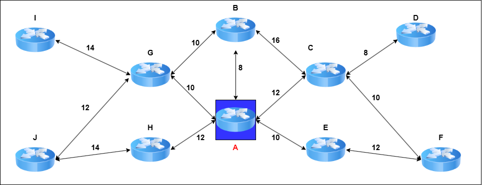
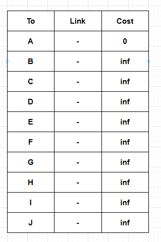

## What is Routing Algorithm?
A routing algorithm is a method used by routers to determine the most efficient path for forwarding packets from a source to a destination in a network. When a packet arrives at a router, the router examines its destination IP address, consults its routing table, and applies the routing algorithm to select the best possible path based on metrics like hop count, bandwidth, delay, and link cost.

# Routing Algorithms

### Distance Vector Routing
Distance Vector Routing works by having each router maintain a table that lists the best known distance to each destination and the best link to use. Routers update their tables by exchanging information with their neighbors. Over time, each router learns the best path to every destination.

**Each router's table includes:**

* Next Hop – The best neighboring router to forward packets.
* Distance – The estimated cost to reach the destination (measured in hops or other metrics)

We will learn step by step how a router makes the table using the algorithm based on the following network for the router A.

We can see that there are 10 routers naming from A to J. Router A has the neighbor name B, C, E, G, H.

**Step 1**
Router A has come back to online and has the following routing table initially. Except his all the cost is initialized as inf. 

**Step 2**
After coming to the online it will send the hello packet to its neighbor. The neighbor will send back the acknowledgment. Based on the time between hello packet send and receive acknowledgment it will update the neighbor cost in the table.

**Step 3**
All of the routers then send their routing table to their immediate neighbor. A will send this table to its neighbor B, C, G and also will receive their routing table from them. The neighbors has the following routing tables. It will use the following formula.

* The acknowledgment includes the original timestamp (T1).

* When the original sender receives the ACK, it records the current timestamp (T2).

* The Round-Trip Time (RTT) is calculated as:

RTT=T2−T1
Since RTT includes both forward and return delays, you can estimate the one-way delay as:

D(A,Neighbor)= RTT/2

**Step 4**
A will then will estimate cost via the algorithm.
For the neighbors it will 

**Dist(A,X) = min[ Dist(A,X), D(A,Neighbor) + D(Neighbor,X)]**