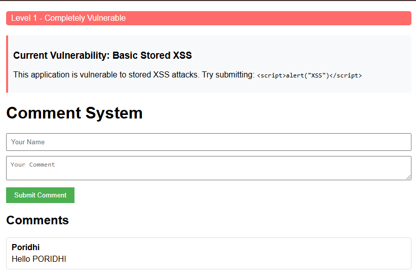
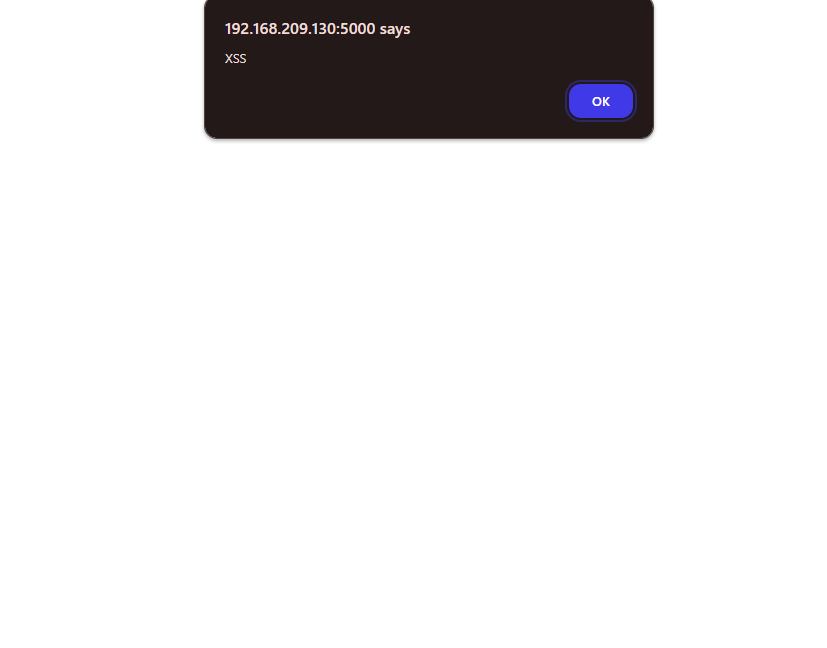
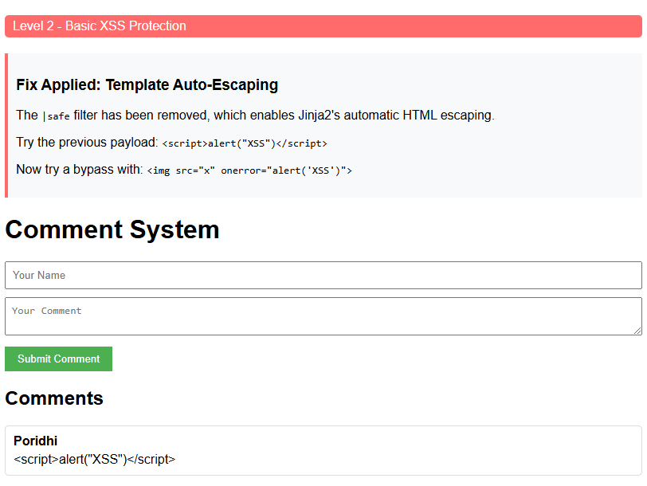
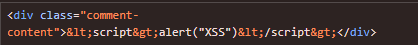
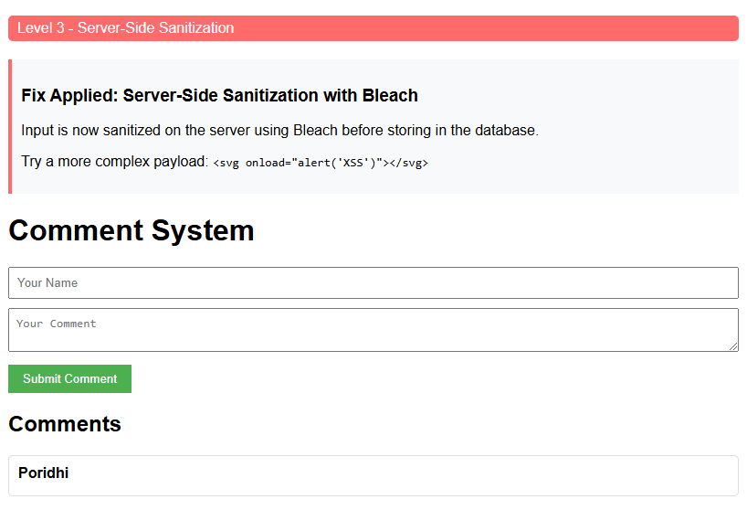
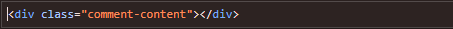
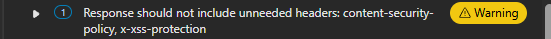
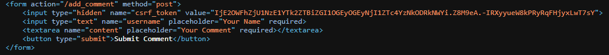
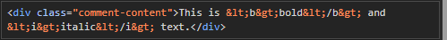
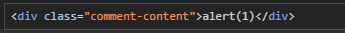

# Stored XSS Vulnerabilities: A Practical Tutorial

## Introduction

This tutorial will guide you through different levels of Stored Cross-Site Scripting (XSS) vulnerabilities and their corresponding security fixes using a specially designed Docker container. By the end of this tutorial, you'll understand how stored XSS vulnerabilities work, how they can be exploited, and how to implement defense-in-depth strategies to protect against them.

## Prerequisites

- Basic understanding of web applications
- Docker installed on your system
- Basic knowledge of HTML and JavaScript
- A web browser (Chrome or Firefox recommended)

## What is Stored XSS?

Stored XSS (also known as Persistent XSS) occurs when a malicious script is injected into a website and stored on the target server, such as in a database. The malicious script is then served to other users when they access the affected page. This makes stored XSS particularly dangerous as it can affect multiple users and persists across sessions.

<!-- SCREENSHOT 1: Diagram showing how stored XSS works - attacker input → database → victim browser -->


## Setting Up the Learning Environment

We'll be using a Docker container that provides multiple versions of the same application, each with different levels of security against XSS.

### Pull the Docker Image

```bash
docker pull yeasin97/stored-xss:latest
```

### Running the Container

To run a specific level of the application:

```bash
# Replace X with the level number (1-5 or "final")
docker run -p 5000:5000 yeasin97/stored-xss:latest ./launch.sh X
```

Now access the application by navigating to `http://localhost:5000` in your web browser.

## Level 1: Basic Stored XSS Vulnerability

First, let's start with the most vulnerable version:

```bash
docker run -p 5000:5000 yeasin97/stored-xss:latest ./launch.sh 1
```

### Understanding the Vulnerability

In this level, the application has a comment system where user input is directly rendered in the HTML without any sanitization.

<!-- SCREENSHOT 2: The Level 1 interface showing the comment form -->


### Exploitation

Try submitting a comment with the following payload:

```html
<script>alert("XSS")</script>
```

When you submit this comment and reload the page, you'll notice that the JavaScript executes, displaying an alert box.

<!-- SCREENSHOT 3: Alert box popping up when loading the page with the XSS payload -->

### Why This Happens:

Let's look at the code:

1. The template uses the `|safe` filter, which explicitly disables Jinja2's automatic HTML escaping:
   ```html
   <div class="comment-content">{{ comment.content|safe }}</div>
   ```

2. The server doesn't sanitize user input before storing it in the database:
   ```python
   # No validation or sanitization
   comment = Comment(username=username, content=content)
   ```

This combination allows any HTML or JavaScript to be stored and then executed when the page is loaded.

## Level 2: Template Auto-Escaping

Let's move to the next level:

```bash
docker run -p 5000:5000 yeasin97/stored-xss:latest ./launch.sh 2
```

### The Fix: Template Auto-Escaping

In this level, the application removes the `|safe` filter, enabling Jinja2's automatic HTML escaping.

<!-- SCREENSHO 4: Level 2 interface showing that the script tag is displayed as text rather than executing -->


Try the same payload:

```html
<script>alert("XSS")</script>
```

Notice that the script is displayed as text rather than being executed. This is because the template engine automatically converts special characters like `<` and `>` to their HTML entities (`&lt;` and `&gt;`).


<!-- SCREENSHOT 5: Show what was stored in html -->


While template escaping helps prevent the most basic XSS attacks, it might not protect against all variants.

## Level 3: Server-Side Sanitization

Let's move to the next level:

```bash
docker run -p 5000:5000 yeasin97/stored-xss:latest ./launch.sh 3
```

### The Fix: Server-Side Sanitization

This level adds server-side sanitization using the Bleach library:

```python
# Server-side sanitization with Bleach
username = bleach.clean(request.form.get('username'), strip=True)
content = bleach.clean(request.form.get('content'), strip=True)
```

<!-- SCREENSHOT 6: Level 3 interface showing sanitized content -->

Try this more complex payload:

```html
<svg onload="alert('XSS')"></svg>
```

The Bleach library removes potentially dangerous HTML tags and attributes before storing them in the database. So there is nothing like (`&lt;` and `&gt;`)..



## Level 4: Content Security Policy

Let's move to the next level:

```bash
docker run -p 5000:5000 yeasin97/stored-xss:latest ./launch.sh 4
```

### The Fix: Content Security Policy

This level adds a Content Security Policy (CSP) header:

```python
# Add Content Security Policy
response.headers['Content-Security-Policy'] = "default-src 'self'; script-src 'self'; object-src 'none'"
```

<!-- SCREENSHOT 7: Browser console showing CSP violation when attempting to run scripts -->


Try this payload that attempts to load an external script:

```html
<script src="https://malicious-site.com/xss.js"></script>
```


Even if a malicious script somehow made it through other protections, CSP provides an additional layer of defense by controlling which resources can be loaded and executed.

## Level 5: CSRF Protection & Security Headers

Let's move to the next level:

```bash
docker run -p 5000:5000 yeasin97/stored-xss:latest ./launch.sh 5
```

### The Fix: CSRF Protection and Additional Security Headers

This level adds CSRF protection and additional security headers:

```python
# Content Security Policy
response.headers['Content-Security-Policy'] = "default-src 'self'; script-src 'self'; object-src 'none'"
# Prevent MIME type sniffing
response.headers['X-Content-Type-Options'] = 'nosniff'
# Prevent clickjacking
response.headers['X-Frame-Options'] = 'SAMEORIGIN'
# Enable XSS protection in browsers
response.headers['X-XSS-Protection'] = '1; mode=block'
```

<!-- SCREENSHOT  8: Form with CSRF token visible -->


Notice the CSRF token in the form. This prevents Cross-Site Request Forgery attacks, which are often used in combination with XSS.

## Final Level: Comprehensive Security

Finally, let's see the fully secured version:

```bash
docker run -p 5000:5000 yeasin97/stored-xss:latest ./launch.sh final
```

### The Fix: Defense in Depth

The final level implements a comprehensive security approach:

<!-- SCREENSHOT  9: Final level interface showing allowed formatting options -->

Key security features:

1. **Input Validation**: Enforces length restrictions and checks for required fields
2. **Input Sanitization**: Uses Bleach with a whitelist of allowed HTML tags
3. **Output Encoding**: Automatic template escaping
4. **Content Security Policy**: Restricts script sources
5. **CSRF Protection**: Requires a valid token for form submission
6. **Security Headers**: Multiple headers for defense in depth
7. **HTTPOnly Cookies**: Prevents JavaScript access to cookies

Try submitting a comment with allowed formatting:

```html
This is <b>bold</b> and <i>italic</i> text.
```



Try submitting a comment with disallowed formatting:

```html
This is <script>alert(1)</script>
```



Notice that only the specifically allowed tags work, while all others are either escaped or removed.

## Summary: Defense in Depth

Securing against XSS requires multiple layers of protection:

1. **Input Validation** - Reject invalid input
2. **Input Sanitization** - Clean or neutralize potentially dangerous input
3. **Output Encoding** - Encode special characters when displaying user content
4. **Content Security Policy** - Restrict which scripts can execute
5. **Security Headers** - Additional browser protections
6. **CSRF Protection** - Prevent cross-site request forgery
7. **HTTPOnly Cookies** - Protect cookies from JavaScript access

<!-- SCREENSHOT  10: Diagram showing these layers of defense will be added -->


## Conclusion

Stored XSS vulnerabilities can have serious security implications. By understanding how these vulnerabilities work and implementing multiple layers of protection, you can significantly reduce the risk to your applications and users.

Remember that security is a continuous process. New vulnerabilities and bypass techniques are discovered regularly, so it's important to stay informed and update your security practices accordingly.

## Additional Resources

- [OWASP XSS Prevention Cheat Sheet](https://cheatsheetseries.owasp.org/cheatsheets/Cross_Site_Scripting_Prevention_Cheat_Sheet.html)
- [Content Security Policy Reference](https://content-security-policy.com/)
- [Bleach Documentation](https://bleach.readthedocs.io/)
- [Flask Security Documentation](https://flask.palletsprojects.com/en/2.0.x/security/)
