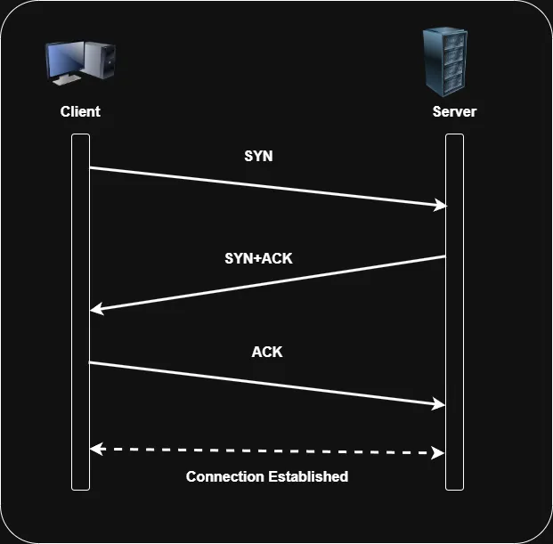

# TCP/IP MODEL
## Introduction
The OSI reference model consists of seven layers that represent a functional division of tasks required to implement a network. It serves as a conceptual tool to illustrate how various protocols and technologies work together to establish communication. However, it is not the only networking model that organizes tasks into layers and components. However, it's not the
only networking model that attempts to divide tasks into layers and components. A more practical and widely used model is the TCP/IP (Transmission Control Protocol/Internet Protocol) model. 

The TCP/IP  model is the foundation of modern networking and the internet. It defines how data is transmitted and received across networks, ensuring seamless communication between devices worldwide.

## TCP/IP VS OSI
Both the TCP/IP model and the OSI model are used to describe how data is transmitted over a network. While the OSI model is a theoretical framework, the TCP/IP model is a practical and widely used protocol suite.

* In TCP/IP's Application Layer, the functions of three OSI layers (Application, Presentation, Session) are merged into a single layer. This means all application services, data formatting, and session control happen in one unified layer instead of three separate ones.

* The Transport Layer stays identical in both models - performing the same end-to-end communication functions. No merging was needed here as both models handle transport tasks similarly.

* The Network Layer of OSI becomes the Internet Layer in TCP/IP. This was mainly a name change to reflect its role in internet communications, while keeping similar routing and addressing functions.

* TCP/IP's Network Access Layer combines the functions of OSI's bottom two layers (Physical and Data Link). Instead of separating physical transmission from basic data handling, TCP/IP handles both hardware-level tasks in one layer.

## Layers of TCP/IP

## 4. Application Layer:
The Application Layer in the TCP/IP model is responsible for interacting with end-user applications and providing network services. Since the TCP/IP model does not have separate Presentation and Session layers like the OSI model, the Application Layer performs the functions of all three layers of OSI model.
* **Application layer functions:** Provides network services directly to applications (e.g., web browsing, email, file transfer). Examples of protocols: HTTP, HTTPS, FTP, SMTP, DNS, Telnet.
* **Presentation layer functions:** Handles data formatting, encryption, and compression. Converts data into a format that applications can understand (e.g., JPEG, MP3, MP4, TLS encryption).
* **Session Layer functions:** Manages and maintains communication sessions. Responsible for establishing, maintaining, and terminating sessions between devices (e.g., NetBIOS, RPC, SOCKS).

## 3. Transport Layer:
The Transport Layer in the TCP/IP model is responsible for end-to-end communication, ensuring reliable or fast data transfer between devices. It provides mechanisms for error detection, flow control, and connection management.
* **Connection-Oriented Communication:** Ensures reliable data transmission using acknowledgments and retransmissions (e.g., TCP).
* **Connectionless Communication:** Provides fast, lightweight communication without establishing a connection (e.g., UDP).
* **Error Detection and Correction:** Ensures data integrity using checksums and retransmissions.
* Flow Control: Regulates data transmission to prevent congestion or packet loss (e.g., TCP windowing).
* **Multiplexing and Demultiplexing:** Uses port numbers to distinguish multiple applications running on a device (e.g., port 80 for HTTP, port 443 for HTTPS).

## 2. Internet Layer:
The Internet Layer in the TCP/IP model is responsible for addressing, routing, and delivering packets across networks. It enables communication between devices on different networks by providing logical addressing and path determination.

* **Logical Addressing:** Uses IP addresses to uniquely identify devices on a network.
* **Packet Forwarding and Routing:** Determines the best path for data to travel across networks (e.g., using routing protocols like OSPF, BGP).
* **Fragmentation and Reassembly:** Splits large packets into smaller fragments for transmission and reassembles them at the destination.
* **Error Handling and Diagnostics:** Uses protocols like ICMP for error reporting and network diagnostics (e.g., Ping, Traceroute).

## 1. Network Access Layer (Link Layer):
The Network Access Layer (also called the Link Layer) is responsible for physical transmission of data and managing access to the network medium. It ensures that data is correctly formatted and transmitted over the physical network.
* **Physical Addressing:** Uses MAC addresses to identify devices within a local network.
* **Framing:** Encapsulates data into frames for transmission over the network medium.
* **Error Detection and Correction:** Uses techniques like CRC checks to detect errors in transmitted frames.
* **Media Access Control:** Determines how devices share and access the network medium (e.g., CSMA/CD in Ethernet).
* **Physical Transmission:** Defines how data is physically transmitted over cables, wireless signals, or fiber optics.

## TCP/IP Layers and Their Protocols

### Application Layers Protocols:
* **DNS (Domain Name System):**  Translates human-readable domain names (e.g., google.com) into IP addresses (e.g., 142.250.190.78), allowing computers to locate servers.
* **DHCP (Dynamic Host Configuration Protocol):** Automatically assigns IP addresses and network configurations (subnet mask, gateway, DNS servers) to devices on a network.
* **SMTP (Simple Mail Transfer Protocol):** Used for sending emails between mail servers and from email clients to servers. It works with POP3 or IMAP for receiving emails. Example: When you send an email via Gmail (you@gmail.com to friend@yahoo.com), Gmail’s SMTP server (smtp.gmail.com) forwards it to Yahoo’s mail server.
*  **FTP (File Transfer Protocol):** Transfers files between a client and a server over a network, supporting both upload and download operations.
* **HTTP (Hypertext Transfer Protocol):** Enables web communication by transferring web pages, images, and other resources between a client (browser) and a web server.

### Transport Layer Protocols:
* **UDP (User Datagram Protocol):** A connectionless protocol that sends data without establishing a connection, offering faster communication but without guarantees of reliability, ordering, or error checking. It is used when speed is more important than reliability.
* **TCP (Transmission Control Protocol):** Ensures reliable, connection-oriented communication by establishing a connection (via **TCP Handshake**) before data transfer, providing error checking, retransmission of lost data, and flow control. It guarantees that data is delivered in order and without errors.

**TCP Handshake (Three-Way Handshake):**
TCP establishes a connection using a three-step handshake process to ensure that both the client and server are ready to communicate. The steps are:

* SYN (Client → Server): The client sends a SYN packet with a sequence number to request a connection.
* SYN-ACK (Server → Client): The server responds with a SYN-ACK packet, acknowledging the client’s request and including its own sequence number.
* ACK (Client → Server): The client sends an ACK packet, confirming the server’s response, and the connection is established.

### Internet Layer Protocols:
* **IP (Internet Protocol):** Responsible for addressing and routing packets across networks. IP defines the structure of addresses and ensures that packets are sent to the correct destination. Example: When you send a request to access a website, the IP protocol ensures that data packets are directed to the correct server based on its IP address.

* **NAT (Network Address Translation):** Translates private IP addresses on a local network to a public IP address, enabling multiple devices to share a single public IP address when accessing the internet. Example: In a home network, all devices use a private IP address (e.g., 192.168.1.x) and share the router’s public IP (e.g., 203.0.113.5) for internet access through NAT.

* **ARP (Address Resolution Protocol):** Resolves the MAC (Media Access Control) address of a device on a local network, given its IP address. It is used for finding the physical address of a device on a LAN. Example: If a device needs to send data to another device on the same local network, it uses ARP to map the destination IP address to its MAC address.

* **ICMP (Internet Control Message Protocol):** Used for error reporting and diagnostic functions, ICMP helps manage network operations by reporting issues such as unreachable hosts or time exceeded in routing. Example: The ping command uses ICMP to check the reachability of a host and measure round-trip time for messages sent to the destination.

* **RIP (Routing Information Protocol):** A distance-vector routing protocol used to determine the best route for data packets by calculating the number of hops to the destination. RIP uses hop count as its metric, with a maximum of 15 hops allowed. Example: A router in a network can use RIP to communicate with other routers to find the best path for transmitting data.

* **OSPF (Open Shortest Path First):** A link-state routing protocol that uses the shortest path algorithm to determine the most efficient route for data transmission within an Autonomous System (AS). OSPF operates within larger networks and is more scalable than RIP. Example: An enterprise network can use OSPF to efficiently route data between different departments or buildings within the organization.

* **EIGRP (Enhanced Interior Gateway Routing Protocol):** A hybrid routing protocol that combines the features of both distance-vector and link-state protocols. It uses a metric based on bandwidth, delay, load, and reliability to select the best path. Example: A large-scale corporate network can use EIGRP to optimize routing decisions between routers in different geographic locations, ensuring efficient data transmission.

## Network Access Layer Protocols:
* **Ethernet:** The most widely used LAN (Local Area Network) technology that defines the standards for physical connections and data transmission over cables (e.g., twisted pair, fiber optics). Ethernet frames carry data between devices on a local network. Example: A computer using an Ethernet cable to connect to a router on a home or office network sends and receives data through the Ethernet protocol.
* **PPP (Point-to-Point Protocol):** A data link layer protocol used to establish a direct connection between two nodes, often over serial links. PPP provides error detection, authentication, and compression, and is used for connections like dial-up, VPNs, and DSL. Example: A VPN connection between a user and a remote server can use PPP for secure data transmission.

* **ARP (Address Resolution Protocol):** A protocol used to map a known IP address to a MAC (Media Access Control) address on a local network, allowing devices to communicate with each other over Ethernet. ARP operates at the Network Access Layer and enables proper packet delivery within a local network. Example: When a device on a local network sends data to another device, it uses ARP to resolve the destination IP address to the corresponding MAC address, ensuring the packet is correctly addressed.

